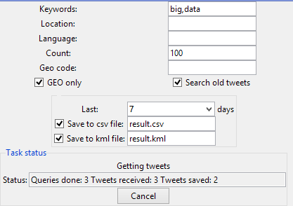

Install
====
1. Extract all files to a folder:

	

2. Open 'must-install' directory and install essential libraries

	

	Choose the correct version, note that the bit width must match your Python version. That is,  if you have Python 3.4 64-bit installed, you have to install the lxml-3.4.1.win-amd64-py3.4.exe .

	**Python 2 is not supported** due to the poor unicode support in Python 2 libraries. Please install Python 3.x.

Usage
====

1. Load the 'search.py' to IDLE:

	

2. Click menu 'Run' -> 'Run Module' or press 'F5' on the keyboard to launch the script

	

	Now the main GUI should show up, it may take a few seconds to load at the first time.

		

3. Config search settings

	There are tree main parts of the GUI:

	1. First is the configuration fields:
	
		
		
		**Keywords** is a comma separated list of words to search.
		
		**Language** is the language of tweets will be in. Twitter will try to search the tweets in that language.

		**Maimum tweets per day** is the maximum number of tweets will be retrieved and stored in the file of one single day, the script will move on to search the tweets sent next day when it reaches the count limit.

		**Search location** when checked, the 'Location' section will become active, and you can set the location information there, twitter will search tweets sent from that location.
		
		**Latitude** the latitude coordinate of the location, must be a floating point number.
		
		**Longitude** the longitude coordinate of the location, must be a floating point number.
		
		**Radius** the radius of the search area, must be an **integer**.
		
		**Radius unit** the unit of the radius, can be "miles" or "kilometers".
		
		**GEO Only** option will make the script only return tweets that contain geo location information.

		**Search old tweets** will make the script only search tweets sent in the past('recent' mode), up to 7 days. If it's unchecked, the script will run in 'mixed' mode, that it, it mixes the old tweets with new tweets.

	2. The second part is the option panel for 'recent mode', it's only available when 'Search old tweets' was checked.
	
		
		
		**Last n days** will tell the script only search tweets that were sent in last n days. You can select up to 7 days.

		**Save to csv file** checkbox will make the script save the result in a csv file, the text field after that is the file name.

		**Save to kml file** checkbox will make the script save the result in a KML file, the file contains a list of place markers, you can open the kml file in Google Earth and see each tweet's location.

	3. The third part is 'Task Status' panel, it will show the status when the search task is running.
	
		
		
		
		
		When the API limit is reached, the status will change:
		
		
		
		**Notice: The default API limit window is 15 minutes, and the default request limit of the search API is 180 per window, that means the script can only make up to 180 queries in 15 minutes, each query can hold upto 100 results(tweets), to get more tweets the script has to wait until next window, so there are roughly 18000 tweets retrieved in every 15 minutes, but note that not all of them will be saved to csv/kml if 'Geo Only' was checked.**
		
	4. The last part is the description and control buttons
	
		
		
		The description and arguments are for commandline use. In other words, `search.py` can run in commandline mode, to make it run in commandline, simply change the `RUN_GUI` option in the script to `False`.
		
		
		
		When you click the 'Run' button, the search will begin, and the result will be saved to the 'result' folder under current folder:
		
		
		
		Each subfolder in 'result' folder contains the tweets of that day.
		
Configs
=====

The script will create a config file under the same folder of the script. To be able to use Twitter's API, you will have to register an app in Twitter's developer portal, and obtain your `consumer_key`, `consumer_secret`, `access_token` and `access_token_secret` information.

Usually you don't need to change these settings.
	